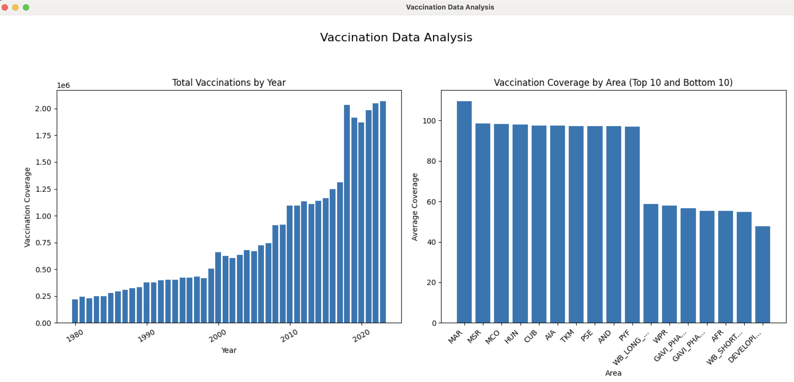
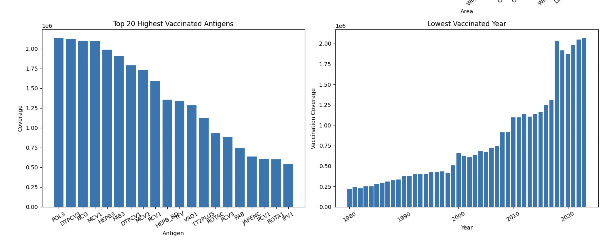
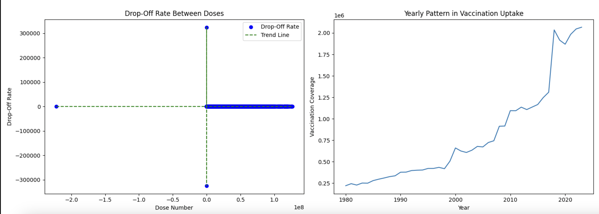

# Vaccination Data Analysis Project

## Project Overview

This project focuses on analyzing and visualizing global vaccination data to provide insights into vaccination trends, disease incidence, and resource allocation. It leverages Python for data extraction and cleaning, SQL for database management, and Tableau for interactive dashboards.

---

## Table of Contents

- [Introduction](#introduction)
- [Technologies Used](#technologies-used)
- [Directory Structure](#directory-structure)
- [Data Sources](#data-sources)
- [Setup and Installation](#setup-and-installation)
- [Key Features](#key-features)
- [Deliverables](#deliverables)
- [Insights Generated](#insights-generated)

---

## Introduction

The Vaccination Data Analysis project aims to address key public health challenges by analyzing vaccination data and providing actionable insights. Key objectives include:

- Understanding vaccination coverage trends over time and across regions.
- Identifying regions with high disease incidence despite vaccination efforts.
- Evaluating vaccination drop-off rates between doses.

---

## Technologies Used

- **Python**: Data extraction, cleaning, and visualization.
- **SQL**: Structured and normalized database setup.
- **Tableau**: Interactive dashboards for data visualization.

---

## Directory Structure
```
Vaccination-Data-Analysis
│
├── analysis_scripts
│   ├── plot_helpers.py
│   ├── data_cleaning.py
│   ├── data_extraction.py
│
├── cleaned_xlsx
│   ├── cleaned_coverage_data.xlsx
│   ├── cleaned_incidence_rate.xlsx
│   ├── cleaned_reported_cases.xlsx
│   ├── cleaned_vaccine_introduction.xlsx
│   ├── cleaned_vaccine_schedule_data.xlsx
│
├── dashboards
│   ├── vaccination_dashboard.pbix
│
├── database
│   ├── create_tables.sql
│   ├── insert_data.sql
│   ├── queries.sql
│
├── README.md
└── .env
```

## Data Sources

The analysis uses cleaned versions of the following datasets:

1. `coverage_data.xlsx`: Vaccination coverage by region and year.
2. `incidence_rate.xlsx`: Disease incidence rates across regions.
3. `reported_cases.xlsx`: Reported cases of vaccine-preventable diseases.
4. `vaccine_introduction.xlsx`: Details on vaccine introductions.
5. `vaccine_schedule_data.xlsx`: National immunization schedules.

---

## Setup and Installation

1. Clone the repository:
2. Set up a Python virtual environment and install dependencies:
3. Configure database connection details in the `.env` file.
4. Run SQL scripts in the `database` folder to set up and populate the database.
5. Open Tableau and connect to the database or load the `vaccination_dashboard.twb` file.

---

## Key Features

- **Data Cleaning**: Handled missing values, inconsistent formats, and outliers.
- **Exploratory Data Analysis**:
  - Trends in vaccination coverage.
  - Correlations between vaccination coverage and disease incidence.
- **Interactive Dashboards**: Tableau dashboards showcasing key insights.

---

## Deliverables

1. **Python Scripts**: For data extraction and cleaning.
2. **SQL Database**: Structured and normalized for easy querying.
3. **Tableau Dashboards**: Interactive visualizations with actionable insights.

---

## Insights Generated

- **Vaccination Trends**: Identified trends in vaccination uptake over time.
- **Disease Incidence Analysis**: Highlighted regions with high disease incidence despite high vaccination rates.
- **Resource Allocation**: Provided insights for targeted interventions in underperforming regions.

---

## Note

Ensure that your database credentials are securely stored and not shared in public repositories.

## Plots





